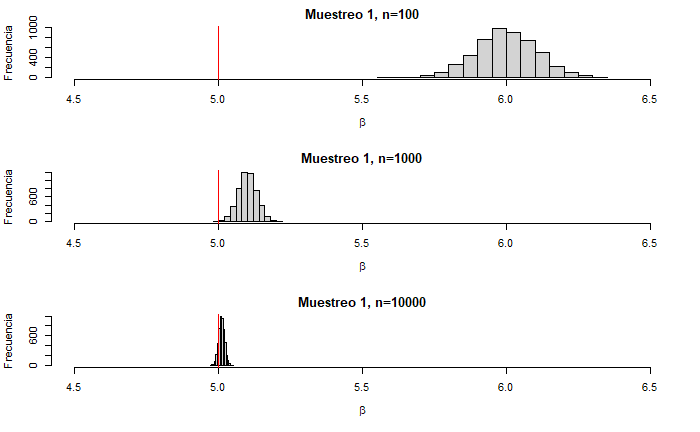
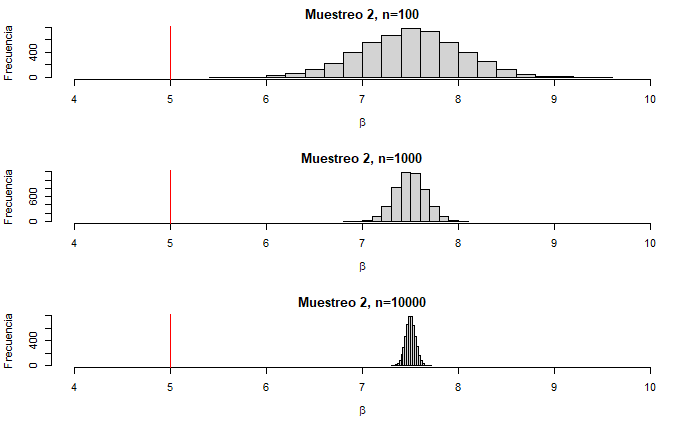
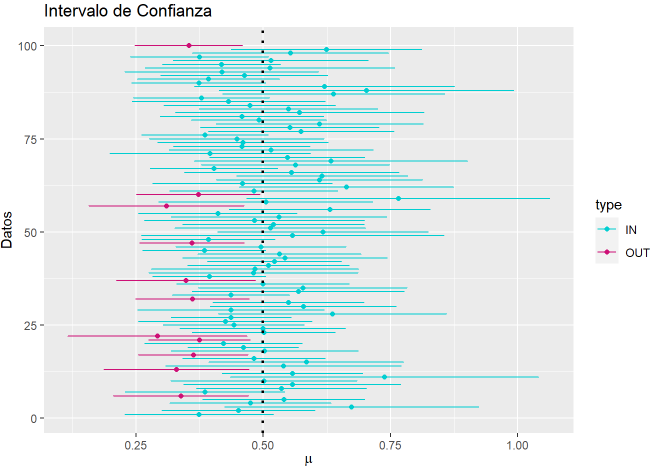

<center> <h1>Tarea 2: Frequentist Inference </h1> </center>
<center><strong>CC6104: Statistical Thinking</strong></center>
#### **Integrantes :** 

- Rafael De La Sotta
- Felipe Ortúzar

#### **Cuerpo Docente:**

- Profesor: Felipe Bravo M.
- Auxiliar: Sebastian Bustos e Ignacio Meza D.
            

#### **Fecha límite de entrega:**

### **Índice:**

1. [Objetivo](#id1)
2. [Instrucciones](#id2)
3. [Referencias](#id3)
2. [Primera Parte: Preguntas Teóricas](#id4)
3. [Segunda Parte: Elaboración de Código](#id5)

### **Objetivo**<a name="id1"></a>

Bienvenid@s a la segunda tarea del curso Statistical Thinking. Esta tarea tiene como objetivo evaluar los contenidos teóricos de la segunda parte del curso, los cuales se enfocan principalmente en inferencia estadística, diseño de experimentos y test de hipótesis. Si aún no han visto las clases, se recomienda visitar los enlaces de las referencias.

La tarea consta de una parte teórica que busca evaluar conceptos vistos en clases. Seguido por una parte práctica con el fin de introducirlos a la programación en R enfocada en el análisis estadístico de datos. 

### **Instrucciones:**<a name="id2"></a>

- La tarea se realiza en grupos de **máximo 2 personas**. Pero no existe problema si usted desea hacerla de forma individual.
- La entrega es a través de u-cursos a más tardar el día estipulado en la misma plataforma. A las tareas atrasadas se les descontará un punto por día.
- El formato de entrega es este mismo **Rmarkdown** y un **html** con la tarea desarrollada. Por favor compruebe que todas las celdas han sido ejecutadas en el archivo html.
- Al momento de la revisión tu código será ejecutado. Por favor verifica que tu entrega no tenga errores de compilación.
- No serán revisadas tareas desarrolladas en Python.
- Está **PROHIBIDO** la copia o compartir las respuestas entre integrantes de diferentes grupos.
- Pueden realizar consultas de la tarea a través de U-cursos y/o del canal de Discord del curso. 


### **Referencias:**<a name="id3"></a>

Slides de las clases:

- [Introduction to Statistical Inference](https://github.com/dccuchile/CC6104/blob/master/slides/ST-inference.pdf)
- [Design of Experiments & Hypothesis Testing](https://github.com/dccuchile/CC6104/blob/master/slides/ST-hypothesis.pdf)

Enlaces a videos de las clases:

- Introduction to Statistical Inference: [video1](https://youtu.be/A0BAhO9_RSI) [video2](https://youtu.be/6Io555e2stM) [video3](https://youtu.be/2-Q2f6zmTns) [video4](https://youtu.be/Hp2A5EJoXbk) [video5](https://youtu.be/M0Ag4bww7Q0) [video6](https://youtu.be/K7khgecup3I) [video7](https://youtu.be/uZ126Lh3L-k) [video8](https://youtu.be/kHSPx99nJ7g)
- Design of Experiments & Hypothesis Testing: [video1](https://youtu.be/3MueyHnNNig) [video2](https://youtu.be/JuyIrya23E0) [video3](https://youtu.be/OXTyG6DIvK4) [video4](https://youtu.be/95QeSwrNoLI) [video5](https://youtu.be/ZCr3WCdc-54) [video6](https://youtu.be/T6ZR0KoKhBQ)

Documentación:

- [ggplot2](https://ggplot2.tidyverse.org/)

# Primera Parte: Preguntas Teóricas<a name="id4"></a>
A continuación, se presentaran diferentes preguntas que abordan las temáticas vistas en clases. Por favor responda cada una de estas de forma breve.

#### **Pregunta 1:**
A continuación, se presenta una serie de declaraciones relacionadas con el sesgo en el muestreo, señale de forma breve el tipo de sesgo que se observa y como podría solucionar el problema de sesgo. Si no observa sesgo en alguna de las declaraciones, comente solamente que es un experimento sin sesgo:

  1. La Tercera quiere conocer la opinión de la gente sobre una propuesta de ley sobre el matrimonio igualitario. Un reportero del diario sale de la central ubicada en Las Condes y selecciona al azar a 300 personas que pasean por allí, preguntándoles sobre la ley propuesta. ¿Qué podemos decir de este plan de muestreo?.

>Si bien es una muestra al azar, no es representativa, púes es al azar solo dentro de cierto subjunto. Este sería un sesgo de **conveniencia**, pues se escogen personas que son más faciles de entrevistar en vez de priorizar la representatividad del conjunto.

  2. Una empresa de telefonía quiere conocer el grado de satisfacción de los propietarios de su nuevo servicio 5g, para ver que tal es la calidad del servicio entregado. Para ello, selecciona al azar 500 números entre todo el conjunto de clientes, colocándose en contacto telefónico con ellos. ¿Qué podemos decir de este plan de muestreo?

> Quien tenga problemas de conectividad no podrá responder la encuesta. En esta muestra el sesgo más probable de ocurrir es del marco de muestreo (**sampling frame bias**), pues el grupo de personas con problemas de conexión no está incluida en el espacio muestral.

  3. Una compañía aérea quiere hacer una encuesta a sus clientes para mejorar su servicio. Durante un mes, envía un correo electrónico a una muestra aleatoria de clientes que hayan volado con la aerolínea el día anterior (ningún cliente será contactado más de una vez). En el correo electrónico se indica que la compañía aérea desea que el cliente rellene una encuesta de 10 minutos para ayudar a la compañía a mejorar su servicio. ¿Qué podemos decir de este plan de muestreo? ¿el sorteo de un producto podría solventar esto?.
  
> Las personas que respondan las encuesta serán quienes logren destinar 10 minutos en ella, para lo cual se requiere de tiempo y motivación. Este grupo de personas no necesariamente es un grupo representativo. Es por esto que probablemente existirá un sesgo de **no respuesta**.

>El sorteo de un producto podría aumentar el número de personas y como consecuencia reducir el sesgo. Aun así, el grupo de personas que no quieren responder no necesariamente se anularía, por lo que seguiria parte del sesgo, aunque probablemente menor.


#### **Pregunta 2:**
Explique una buena practica para desarrollar un muestreo, ¿Cree que en una encuesta real es factible obtener una muestra sin sesgo?

Una buena práctica de muestreo es el muestreo aleatorio (random sample), el cual puede ser estratificado o no. Este método se utiliza para evitar sesgos en la elección de la población. El muestreo aleatorio estratificado, si bien es al azar, asegura ciertos porcentajes de participación de subconjuntos de la población.

Existen distintos tipos de sesgo, algunos son más dependiente de quien realiza la encuesta (sesgo de tamaño, sesgo de conveniencia, etc) y otros de los entrevistados (no respuesta, respuesta inorrecta, etc). Quien realiza la encuesta puede minimizar ciertos sesgos pero anularlos no es factible. Es por esto que en una encuesta real no es factible obtener una muestra sin sesgo.  

#### **Pregunta 3:**
Nombre una ventaja y una desventaja del método de máxima verosimilitud. Justifique cada una de las ventajas y desventajas señaladas.

Para utilizar este método se le debe entregar una diistribución a priori, es decir, se deben visualizar y analizar los datos. Esto representa una **desventaja** a la hora de buscar la distribución óptima de los datos, pues la selección de la distribución representa gran parte del trabajo.

Por medio de este método el problema de estimación se transforma en un problema de optimización. Esto representa una **ventaja**, pues se puede encontrar un óptimo minimizando una ecuación.

#### **Pregunta 4:**
Considere que recopila $X_{1},...,X_{n} \sim Poisson(\theta)$ donde $\theta$ es un parámetro desconocido. Calcule el estimador de máxima verosimilitud para $\theta$. Considere la siguiente expresión para la Poisson:

$$ f(X_{i};\theta) = \prod_{i=1}^{n} \frac{\theta^{X_{i}}e^{-\theta}}{X_{i}!}$$

**Nota:** Puede ser útil utilizar el logaritmo natural para inferir $\theta$.

$$ ln(f(X_{i};\theta)) = \sum_{i=1}^{n}(X_{i} \cdot ln(\theta) - \theta  - ln(X_{i}!))$$
$$ ln(f(X_{i};\theta)) = \sum_{i=1}^{n} X_{i} \cdot ln(\theta) - n \cdot \theta  - \sum_{i=1}^{n} ln(X_{i}!)$$
Ahora optimizamos, derivando e igualando a cero. Primero, derivamos la expresión:

$$ \frac{d ln(f(X_{i};\theta))}{d \theta} = \sum_{i=1}^{n} X_{i} \cdot \frac{1}{\theta} - n$$
Luego, igualamos a cero, con lo cual se obtiene lo siguiente:

$$ \frac{d ln(f(X_{i};\theta))}{d \theta} = 0 \longrightarrow \theta = \frac{\sum_{i=1}^{n} X_{i}}{n}$$
Es decir, el estímador de máxima verosimilitud de $\theta$ corresponde a la media de los valores $X_{i}$.

#### **Pregunta 5:**
Suponga que usted ha realizado una `sampling distribution` de dos encuestas diferentes en los que obtiene los datos `Muestreo 1` y `Muestreo 2`, al momento de estimar el parámetro $\beta$ de cada uno de los muestreos, se da cuenta que el estimador para los diferentes datos varia según el tamaño de observaciones (n). Al darse cuenta de esto, gráfica el histograma del comportamiento de los estimadores, obteniendo los siguientes gráficos:

<p float="left">
   
  
</p>

Suponiendo que la linea roja en los gráficos representa el valor real del parámetro para cada muestra, comente las características que observa en la evolución del estimador para el `Muestreo 1` y el `Muestreo 2`.

La muestra 1 representa de mejor forma al conjunto total. Esta debe ser una muestra insesgada, la cual probablemente se obtiene al azar (random sampling). Al ser una muestra insesgada, esta representa al conjunto y por ley de los grandes números el parámetro $\beta$ tiende al valor real. 

La muestra 2 no representa al conjunto total, lo que significa que existe por lo menos un tipo de sesgo en esta muestra. Se puede ver claramente como los datos convergen a un valor erroneo de $\beta$, con esto podemos saber que el sesgo no es de tamaño, sino que del grupo escogido.


#### **Pregunta 6:**
Considere que esta trabajando con intervalos de confianza al $95\%$ e intenta estudiar un parámetro $\theta$, ¿porque es incorrecto decir, en la visión frecuentista, que la probabilidad que $\theta$ pertenezca al intervalo es del $95\%$?

En la visión frecuentista los parámetros de las distribuciónes son constantes pero desconocidos, lo que varía son los datos que obtenemos. Es por esto que el intervalo es el que puede o no incluir el valor real de $\theta$, ya que este es el ue varía.


#### **Pregunta 7:**
Se sabe que al realizar un test de hipótesis es posible equivocarse al tomar una decisión. Sí denotamos $H_0$ como la hipótesis nula y $H_1$ como la hipótesis alternativa, existen dos posibles errores que se pueden obtener: 

- [X] Rechazar $H_0$ cuando $H_0$ era correcta.
- [X] Aceptar $H_0$ cuando $H_1$ era correcta.

En base a los errores señalados, de un ejemplo de cuando es más relevante disminuir las opciones de aceptar $H_0$, si $H_1$ es la correcta.

> Supongamos que se le está haciendo un test de COVID a una persona. Nuestras hipótesis son las siguientes: 

- $H_1$ tiene COVID. 
- $H_0$ no tiene COVID.

> En este caso es importante disminuir las probabilidades de que $H_0$ sea aceptado cuando $H_1$ es la correcta, pues tendríamos un contagiado por las calles que cree que está bien. Por el contrario, si se le dice que tiene COVID y no tiene esto no compromete la salud de las personas.

#### **Pregunta 8:**
Explique cual es la diferencia entre el test **one-sided** y **two-sided**, de un ejemplo en donde se pueda utilizar **one-sided** y otro donde se pueda utilizar **two-sided**. ¿Es un método mejor que el otro?

**one-sided** se utiliza para comprobar una hipotesis de mayor o menor, es decir, se calcula la probabilidad de que un valor sea solo mayor o solo menor al esperado. Por otro lado, **two-sided** se utiliza en hipotesis de igualdad o desigualdad, por lo que se calcula la probabilidad de que un cierto valor se encuentre en un intervalo. 

**one-sided** puede ser utilizado en un caso donde una empresa asegura que su producto no sobrepasa cierto peso. En este caso, para comprobar la factibilidad de la hipótesis nula se debería hacer un test **one-sided**. 
Por otro lado, **two-sided** puede ser utilizado en un caso donde una empresa asegura que su producto no tiene un peso igual a cierto valor. En este caso, para comprobar la factibilidad de la hipotesis nula se debería calcular la probabilidad de que las muestras esten fuera de un rango del valor en cuestion.

Tanbien se puede utilizar el test **one-sided** en casos que se busca desigualdad y se tiene información de los datos sobre la "dirección" del sesgo. Por ejemplo, si se sabe están obteniendo muchas caras en el lanzamiento de una moneda se puede hacer un test **one-sided** calculando la probabilidad de que esto pase.

#### **Pregunta 9:**

Explique, con sus palabras, a que se refiere la siguiente afirmación: "Un resultado de significancia estadística es distinto a uno de significancia practica". Complemente su respuesta analizando la siguiente frase:

    'Se tienen datos normales de media desconocida. Con los datos, se realiza un test de hipótesis donde la hipótesis nula especifica que la media es cero. Realizando el test, se obtuvo un p-valor de $10^{-10}$, luego producto de este resultado la media necesariamente tiene que ser muy distinta a cero.'

> Tener una significancia estadistica en un test de hipótesis (p-valor pequeño) no asegura que la hipotesis tenga un sentido práctico, pues no se incluyen los rangos del caso de uso. 

> En una distribución gaussiana se puede tener una desviación muy baja, con lo cual datos "cercanos" a la media no obtienen un p-valor grande. En casos de este estilo la significancia estadistica del p-valor nos diría que el valor está lejos, mientras que la práctica que está cerca. En la frase entregada se puede ver como se asume significancia práctiva ante la existencia de significancia estadística.

---

# Segunda Parte: Elaboración de Código<a name="id5"></a>

En la siguiente sección deberá resolver cada uno de los experimentos computacionales a través de la programación en R. Para esto se le aconseja que cree funciones en R, ya que le facilitará la ejecución de gran parte de lo solicitado.

Para el desarrollo preste mucha atención en los enunciados, ya que se le solicitará la implementación de métodos sin uso de funciones predefinidas. Por otro lado, Las librerías permitidas para desarrollar de la tarea 2 son las siguientes:


```{r, eval=FALSE}
#install.packages("plotly", "gridExtra")
#install.packages("gridExtra")

#remove.packages("ggplot2") # Unisntall ggplot
#install.packages("ggplot2") # Install it again
library(ggplot2) 

# Manipulación de estructuras
#library(tidyverse)

# Para realizar plots

#library(plotly)


# Manipulación de varios plots en una imagen.
library(gridExtra)
```


### Pregunta 1: Estimadores.
Esta pregunta tiene como objetivo comprobar a través de gráficos las características que poseen los estimadores.Por favor responda de forma separada las siguientes preguntas: 

- [ ] En clases se vio que el estimador $\hat{p}_{n} = \frac{1}{n} \displaystyle{\sum_{i=1}^{n}}X_{i}$ es un estimador consistente para $X_{i}$ Bernoulli de tasa $p$, verifique esto númericamente para una distribución Bernoulli de $p=0.5$, es decir grafique como se ve $\hat{p}_{n}$ para valores de $n$ y compárelo con el valor verdadero.

- [ ] Sabemos que no todos los estimadores insesgados son consistentes. Considere  el estimador $T_{n} = \hat{p}_{n} + \epsilon_{n}$ donde $\epsilon_{n} \sim \mathcal{N}(0,1)$ es posible verificar que $T_{n}$ es insesgado pero no es consistente, para ver esto repita lo que realizo en el punto anterior y estudie lo que sucede. ¿Porque cree que no es consistente el estimador?, Justifique su respuesta.

**Punto 1**

En el siguiente gráfico se puede ver como al aumentar el número de la muestra el estimador de p, $\hat{p}_{n}$, tiende a p.
Por medio de este ejercicio gráfico se puede comprobar que $\hat{p}_{n}$ es insesgado y consistente.

$$E(\hat{p}_{n}) = p$$

$$\lim_{n \to \infty}(\hat{p}_{n}) = p$$

```{r, eval=TRUE}
library(Rlab)
n_val = 1000
p = 0.5

list_p_gorro <- c(1:n_val)  # valores del estimador de p
list_p <- c(1:n_val)  # valores de p

list_bern = rbern(n_val, p)

suma_p   <- 0
contador <- 0

for (i in 1:n_val){
  contador <- contador + 1
  suma_p <- suma_p + list_bern[i]
  p_gorro <- suma_p/contador
  list_p_gorro[i]=p_gorro
  list_p[i]=p
}
plot(c(1:n_val), list_p_gorro, type = "l", col = "blue", xlim=c(1,n_val), ylim=c(0,1), ylab = "Probabilidad", xlab = "Muestra", main= "P estimado versus valor real de P en función del número de muestras")
lines(c(1:n_val), list_p, type = "l", col = "orange")

legend(800, 0.9, legend=c("P estimado", "P"),
       col=c("blue", "orange"), lty=1:2, cex=0.8)
```

**Punto 2**

En el siguiente gráfico se puede ver como al aumentar el número de la muestra el estimador de p, $\hat{p}_{n}$, no logra tender a p, aunque su media sea p, esto se debe a que el error gaussiano se mantiene independiente de la cantidad de valores.
Por medio de este ejercicio gráfico se puede comprobar que $T_{n}$ es insesgado pero no consistente.

$$E(T_{n}) = E(\hat{p}_{n}) + E(\epsilon_{n}) = p + 0 = p$$
$$\lim_{n \to \infty}(T_{n}) \neq p$$

```{r, eval=TRUE}
library("Rlab")

n_val = 1000
p = 0.5

list_p_gorro <- c(1:n_val)  # valores del estimador de p
list_p <- c(1:n_val)  # valores de p
list_e <- rnorm(n_val)
list_bern = rbern(n_val, p)

suma_p   <- 0
contador <- 0

for (i in 1:n_val){
  contador <- contador + 1
  suma_p <- suma_p + list_bern[i]
  p_gorro <- suma_p/contador
  list_p_gorro[i]= p_gorro + list_e[i]
  list_p[i]=p
}
plot(c(1:n_val), list_p_gorro, type = "l", col = "blue", xlim=c(1,n_val), ylim=c(0,1), ylab = "Probabilidad", xlab = "Muestra", main= "P estimado versus valor real de P en función del número de muestras")
lines(c(1:n_val), list_p, type = "l", col = "orange")

legend(800, 0.9, legend=c("P estimado", "P"), col=c("blue", "orange"), lty=1:2, cex=0.8)
```
---

### Pregunta 2: Intervalo de Confianza
El objetivo de esta pregunta es visualizar los intervalos de confianza en datos simulados de una población, para visualizar la incertidumbre que presenta una estimación. Para esto, ustedes deberán generar datos de una distribución exponencial, la cual deberán considerar como los datos de la población. En base a los datos generados, simulen la `sampling distribution` de la media muestreal. Notar que el valor obtenido en cada muestra les entregará un estimador de la media, o sea, para cada valor podremos calcular un intervalo de confianza. Hecho esto, calculen el intervalo de confianza del $95\%$ para cada una de las medias estimadas, utilizando la función de cuantil vista en clases.

Para la elaboración de esta parte de la tarea, se recomienda realizar el experimento con la siguiente secuencialidad:

- [ ] Obtener la media de la población (en este caso la exponencial).
- [ ] Realizar una `sampling distribution` con un tamaño de muestra igual a $30$ sobre los datos generados de la población. Repita la obtención de la media un número elevado de veces (recomendación $5000$ veces).
- [ ] Calcular el intervalo de confianza del $95\%$ para cada uno de las medias obtenidas en las iteraciones.
- [ ] De acuerdo a los valores obtenidos (medias e intervalos de confianza), grafique cada una de las medias obtenidas en conjunto a sus intervalos de confianza. Aquí debe notar que, si el intervalo de confianza contiene a la media de la población, este se considerará como parte del intervalo de confianza del $95\%$, haga un conteo de cuantos valores están contenidos en este intervalo.
- [ ] Señalar en el plot de intervalo de confianza los valores que están dentro y fuera del intervalo. Comente que visualiza de los intervalos de confianza obtenidos, ¿existe incertidumbre?.
- [ ] En base al conteo realizado en el punto anterior, observe cómo se comporta la proporción de intervalos de confianza, ¿es acaso este igual al $95\%$ teórico usado para calcularlo?.

**Notar:** Responder cada una de las preguntas señaladas en esta sección.

**Hints**: 

- Para realizar la `sampling distribution` podría serle útil el comando `sample()`.
- Puede ser útil generar un dataframe para graficar con ggplot2.

<details>
<summary>Gráfico esperado para intervalos de confianza</summary>
<p>

Del gráfico es posible observar que la línea punteada es la media de la población y los puntos de colores son las estimaciones con sus respectivos intervalos de confianza. Notar que para el plot no se utilizaron las 5000 veces, se recomienda utilizar 100 valores para visualizar bien el fenómeno.



</p>
</details>  

---
```{r, eval=TRUE}
library(ggplot2)
library(reshape2)

# Definimos tamaños de muestreo
tamano_muestra = 30
n_muestras = 5000

# Generamos una exponencial para luego generar el subsampling de ella
exponencial = rexp(10000, rate = 2)
#exponencial = rnorm(10000)
# Obtenemos la media poblacional de la exponencial
media_poblacional <- mean(exponencial)


# Sampling distribution, calculo del intervalo de confianza y proporción.
bool_c <- c()
medias <- c()
left <- c()
right <- c()
alpha <- 0.05
conteo_inside = 0
for (i in (1:n_muestras)){
  sp <- sample(exponencial, tamano_muestra)
  
  media <- mean(sp)
  sigma <- sd(sp)
  
  se <- sigma/sqrt(tamano_muestra)
  error <- qnorm(1-alpha/2)*se
  
  left <-rbind(left, media - error)
  right <- rbind(right, media + error)
  medias <- rbind(medias, media)
  if((media - error) < media_poblacional & media_poblacional < (media + error)){
    conteo_inside = conteo_inside + 1
  }
  bool_c <- rbind(bool_c, (media - error) < media_poblacional & media_poblacional < (media + error))
}
df <- data.frame(id = c(1:5000), mean = medias, right_bound = right,  left_bound = left)


#melt data frame into long format
df <- melt(df ,  id.vars = 'id', variable.name = 'series')

#create line plot for each column in data frame
ggplot(df, aes(id, value)) +
  geom_jitter(size = 0.5, aes(colour = series)) +
  geom_hline(yintercept = media_poblacional, show.legend = "media poblacional")

print(conteo_inside)
print(conteo_inside/n_muestras)
# - En base a la distribución exponencial, generamos multiples sampling 
# distribution.
# - Se estima la media del muestreos y obtenemos el intervalo de confianza de 
# cada una de las muestras

# Plot de Intervalos de confianza (ver respuesta esperada)

# Plot de proporción de Intervalos de confianza
```

La línea negra corresponde a la media poblacional, por lo tanto, si algún punto del color
de "right bound" está más abajo que la media poblacional o punto del color
de "left bound" está más arriba que la media poblacional, entonces esos muestreos dejan
afuera a la media poblacional. Haciendo una inspección visual, existe una mayor incertidumbre
respecto al límite superior (right_bound) en comparación al inferior. Ahora bien, las áreas están notablemente separadas, habiendo una intersección leve en la media poblacional.

```{r, eval=TRUE}
library(ggplot2)
library(reshape2)

# Definimos tamaños de muestreo
tamano_muestra = 30
n_muestras = 500

# Generamos una exponencial para luego generar el subsampling de ella
exponencial = rexp(10000, rate = 2)
#exponencial = rnorm(10000)
# Obtenemos la media poblacional de la exponencial
media_poblacional <- mean(exponencial)


# Sampling distribution, calculo del intervalo de confianza y proporción.
bool_c <- c()
medias <- c()
left <- c()
right <- c()
alpha <- 0.05
conteo_inside = 0
for (i in (1:n_muestras)){
  sp <- sample(exponencial, tamano_muestra)
  
  media <- mean(sp)
  sigma <- sd(sp)
  
  se <- sigma/sqrt(tamano_muestra)
  error <- qnorm(1-alpha/2)*se
  
  left <-rbind(left, media - error)
  right <- rbind(right, media + error)
  medias <- rbind(medias, media)
  if((media - error) < media_poblacional & media_poblacional < (media + error)){
    conteo_inside = conteo_inside + 1
  }
  bool_c <- rbind(bool_c, (media - error) < media_poblacional & media_poblacional < (media + error))
}
df <- data.frame(id = c(1:500), mean = medias, right_bound = right,  left_bound = left)

ggplot(df, aes(mean, id,  colour = factor(bool_c))) +
  geom_pointrange(aes(xmin = left_bound, xmax = right_bound), size=0.1) + 
  geom_vline(xintercept = media_poblacional)
```

El gráfico anterior corresponde al esperado por la pregunta, por lo que corresponde a otra visualización de lo mismo. El color azul corresponde a casos donde las muestras cumplen con que el intervalo de confianza incluye a la media poblacional, mientras que el rojo son muestras que no la incluyen. 

```{r, eval=TRUE}
comportamiento = bool_c
list_ratio <- data.frame(1:n_muestras)
suma_true <- 0
suma_falsa <- 0
for (tirada  in comportamiento){
  if (tirada){suma_true  <- suma_true  + 1}
  else{       suma_falsa <- suma_falsa + 1}
  list_ratio[1+suma_falsa+suma_true, 1] <- suma_true/(suma_falsa + suma_true)
}
dt2 <- data.frame(id2 = c(0:n_muestras), mena = c(list_ratio$X1.n_muestras))
ggplot(dt2, aes(id2, mena)) +
  geom_line(size = 0.5) +
  geom_hline(yintercept = 1- alpha) +
  geom_hline(yintercept = dt2$mena[n_muestras]) +
  ylim(0.8, 1)

```

Con respecto a la proporción de intervalos de confianza, este valor no es igual al 95% (línea superior)
teórico usado para calcularlo. Es, de manera consistente, menor a ese valor y aproximadamente
cercano a un 92% (línea inferior). Esta diferencia se puede deber a que se asume que las muestras se toman
de una población con distribución normal en la característica tomada, por lo que hay ligeras diferencias en las medias y desviación estándar cuando se considera una distribución
exponencial en la población.

---

### Pregunta 3: Estimación de Máxima Verosimilitud

En esta pregunta deberán trabajar con el dataset ``Body Measurements_original.csv``. El objetivo será visualizar e inferir los parámetros que componen a dos variables del dataset. Para esto deberá visualizar el comportamiento de la likelihood, utilizando diferentes cantidades de datos, y realizar la optimización de la likelihood para obtener los estimadores de las variables a través de la función `nlminb()`. Notar que esta pregunta consiste en dos partes.

a) La primera actividad consiste en realizar inferencia sobre la variable ``TotalHeight``, donde deberá asumir y realizar los siguientes puntos:

- [ ] Asuma que los datos de ``TotalHeight`` distribuyen de forma gaussiana. Visualice esto a través de un gráfico de densidad en la variable ``TotalHeight``.
- [ ] Grafique a través de un gráfico de calor el rango de valores en que se mueve la solución del problema de likelihood, para esto defina su problema en base a -log(likelihood). Mas información se entrega en el esqueleto de la pregunta.
- [ ] Visualice cómo se comporta la -log(likelihood) con diferentes cantidades de datos para la estimación de $\mu$; para visualizar esto, fije $\sigma$ en 12 y varié solamente el valor de $\mu$. Para observar el comportamiento del estimador con diferentes cantidades de datos, realice un subsampling de 100 datos, 300 datos y la totalidad de los datos de la variable ``TotalHeight``. ¿Qué se puede observar acerca del comportamiento del estimador $\mu$?, responda brevemente esta pregunta.
- [ ] Finalmente aplique el comando `nlminb()` sobre la likelihood y encuentre el máximo o mínimo del problema a optimizar. Señale implícitamente cuales son los valores obtenidos para $\sigma$ y $\mu$.

b) Para la segunda parte deberá escoger otra de las variables que componen el dataset, como por ejemplo `Age`, y estimar a traves de la -log(likelihood) **solo** los parámetros de la distribución que observa (notar que solo debe inferir los estimadores de variable escogida). Para señalar la distribución de los datos se recomienda realizar el plot de densidad y comparar con el comportamiento de las distribuciones teóricas vistas en clases.

Cabe señalar que el método de máxima verosimilitud deberá ser programado por usted y **no** podrá utilizar librerías que entreguen el valor directo (por ejemplo, la librería MASS).

**Parte a)**

- [ ] En el primer gráfico se puede apreciar la función de densidad de la variable ``TotalHeight``

- [ ] En el segundo gráfico se tiene un mapa de calor de -log(likelihood) acumulado, variando $\sigma$ y $\mu$. En este mapa los valores varían entre 1000 y 20000, aproximadamente. Se aprecia que se obtiene un menor valor para valores cercanos a $\sigma=15$ y $\mu=45$, aproximadamente.

- [ ] En el tercer gráfico se puede apreciar un mapa de calor de -log(likelihood) acumulado, variando la muestra y $\mu$. A medida que aumenta el tamaño de la muestra es menos probable que una muestra ocurra, por lo que su likelihood disminuye. Por otro lado, al aumentar el número de muestra la diferencia entre likelihood de distintos valores de $\mu$ se hace notoria, diferenciandose el minimo de estos valores.

- [ ] En el cuarto gráfico se puede apreciar la distribución de máxima verosimilitud, obtenida por `nlminb()`.

```{r, eval=TRUE}
# Carga de dataset

# Primera Parte
# Plot de densidades de la variables TotalHeight
df <- read.csv('BodyMeasurements_original.csv', header = TRUE, sep= ",", quote = '\"')

d <- density(df$TotalHeight)
plot(d, main = paste("Gráfico de densidad en la variable ``TotalHeight``"))

# Plot de Likelihood
# - Generar una función de la likelihood de la normal
# - Señalar el rango de valores para observar la solución. Genere un vector con 
# los valores

# Plotear gráfico de calor a través filled.contour()
ll_plot <- function(mu, sigma) {
  -sum(dnorm(df$TotalHeight, mean=mu, sd=sigma, log=TRUE))
}

# Vectorizamos nuestra función para recorrer y estimar los valores
ll_plot = Vectorize(ll_plot)

mu = seq(20, 80, by=0.5) # definimos secuencia de 20 -> 80 de 0.5 en 0.5.
sigma = seq(5, 23, by=0.5) # definimos secuencia de 5 -> 23 de 0.5 en 0.5.
ll_plot = outer(X=mu, Y=sigma, ll_plot)

# Obtenemos el mapa de calor con los valores mas probables
filled.contour(x=mu, y=sigma, z=ll_plot, plot.title = title(main = "Mapa de calor de -log(likelihood)", xlab=expression(mu), ylab=expression(sigma)))

# Plot de comportamiento de SOLO mu al variar la cantidad de datos
ll_mean_plot <- function(mu, n) {
  x = sample(df$TotalHeight,n, replace = FALSE, prob = NULL)
  -sum(dnorm(x, mean=mu, sd=12, log=TRUE))
}
n = c(100,300,716)
ll_mean_plot = Vectorize(ll_mean_plot)

ll_mean_plot = outer(X=mu, Y=n, ll_mean_plot)

filled.contour(x=mu, y=n, z=ll_mean_plot, plot.title = title(main = "Mapa de calor de -log(likelihood)", xlab=expression(mu), ylab="Número de muestras"))


# Obtener la solución que minimiza o maximiza la likelihood
# Producto de como funcionan nlminb es necesario definir un nuevo tipo de función
# para encontrar los parametros de la likelihood, por favor revisar estructura entregada.
likelihood <- function(param) {
  # Definimos los parámetros de entrada de la función
  mu = param[1]
  sigma = param[2]
  # Definimos la likelihood como la suma logaritmica de la función de densidad
  return(-sum(dnorm(df$TotalHeight, mean=mu, sd=sigma, log=TRUE)))
}

# Optimizador para encontrar los parametros de la likelihood. Referencia: #https://www.rdocumentation.org/packages/stats/versions/3.6.2/topics/nlminb
resultado <- nlminb(objective=likelihood, start=c(50,15) , lower=c(20,5), upper=c(80,25))

# Compara distribución real con la distribución normal de máxima verosimilitud
d <- density(df$TotalHeight)
y <- dnorm(df$TotalHeight, mean=resultado$par[1], sd=resultado$par[2])


x1 <- df$TotalHeight
y1 <- y

x2 <- d$x
y2 <- d$y

plot(x1,y1,col="red",ylim=range(c(y1,y2)),xlim=range(c(x1,x2)), main="Comparación entre densidad real de los datos y máxima verosimilitud", xlab="TotalHeight", ylab="Density")
lines(x2,y2,col="green")
legend(10,0.04,legend=c("Distribución real","Máxima verosimilitud"), col=c("green","red"),pch=c("-","O"))
```


**Parte b)**

Se escoge utilizar una distribución chi-cuadrado para la variable ''Age''. Se busca la máxima verosimilitud variando los parámetros shape y scale.
En el primer gráfico se puede apreciar la densidad de los datos reales. 
En el segundo gráfico se comparan las densidades de los datos reales con la distribución de máxima verosimilitud.

```{r, eval=TRUE}
# Carga de dataset

# Segunda Parte
# Graficar la densidad y obtener el parámetro de la variable propuesta.
d <- density(df$Age)
plot(d, main = paste("Gráfico de densidad en la variable ``Age``"))

likelihood <- function(param) {
  # Definimos los parámetros de entrada de la función
  shape = param[1]
  scale = param[2]
  # Definimos la likelihood como la suma logaritmica de la función de densidad
  -sum(dgamma(df$Age, shape=shape, scale=scale, log = TRUE))
}

resultado <- nlminb(objective=likelihood, start=c(1,20) , lower=c(0,0.5), upper=c(10,50))

# Compara distribución real con la distribución normal de máxima verosimilitud
d <- density(df$Age)
y <- dgamma(df$Age, shape=resultado$par[1], scale=resultado$par[2])

x1 <- df$Age
y1 <- y

x2 <- d$x
y2 <- d$y

plot(x1,y1,col="red",ylim=range(c(y1,y2)),xlim=range(c(x1,x2)), main="Comparación entre densidad real de los datos y máxima verosimilitud", xlab="Age", ylab="Density")
lines(x2,y2,col="green")
legend(40,0.05,legend=c("Distribución real","Máxima verosimilitud"), col=c("green","red"),pch=c("-","O"))


```


---

### Pregunta 4: Bootstrap

Para esta pregunta será necesario cargar el dataset `SAT_GPA.csv`, con el que estudiaremos la correlación entre las variables SAT y GPA. Dentro de las variables: GPA representa el rendimiento académico de un estudiante en el sistema estadounidense, mientras que SAT es una prueba de admisión universitaria en estados unidos.
Las actividades por realizar en esta pregunta son las siguientes:

- [ ] Visualizar la correlación de los datos.
- [ ] Obtener la correlación entre los datos de las variables ``Total``, quien representa el resultado de la prueba SAT en USA, y la variable ``GPA``.
- [ ] Programar el método Bootstrap para calcular el error estándar de la correlación. Para la simulación utilice un numero de muestras (B) igual a 5000 o algún otro numero de este orden.
- [ ] Visualizar a través de un gráfico el histograma obtenido al realizar el muestreo con Bootstrap.
- [ ] Obtener el 95% de intervalo de confianza de la estimación por cuantiles como se vio en clases.

**Nota:** No se permite la utilización de librerías de bootstrap para esta parte.

**Respuesta:**
```{r, eval=TRUE}
library(corrplot)

data <- read.csv('SAT_GPA.csv', header = TRUE, sep= ",", quote = '\"')
data.cor <- cor(data)
corrplot(data.cor)

```
```{r, eval=TRUE}
Total_USA_cor <- data.cor[10, 11]
print(Total_USA_cor)
```


```{r, eval=TRUE}
nRuns <- 50
x <- x_test <- data[, c(10:11)]
sampleSize <- 126
alpha <-  0.05

values <- vector()
for (i in 1:nRuns){
  values[i] <- cor(x[sample(nrow(x), size = sampleSize, replace = T), ])[2, 1]
  
}
point.est <- cor(x)
se <- sd(values)
lower <- quantile(values, alpha/2)
upper <- quantile(values, 1-alpha/2)

print("Error estandar de correlación")
print(se)
print("\nLímite Superior del intervalo confianza al 95%")
print(upper)
print("\nLímite Inferior del intervalo confianza al 95%")
print(lower)

```

```{r, eval=TRUE}
library(ggplot2)

x1 <- data.frame(Values = values*100)
ggplot( x1 , aes(x = Values)) + 
  geom_histogram(binwidth=0.5, color="black", fill="white") +
  geom_density(alpha=.2, fill="#FF6666") 
```


---

&nbsp;
<hr />
<p style="text-align: center;">A work by <a href="https://github.com/dccuchile/CC6104">CC6104</a></p>

<!-- Add icon library -->
<link rel="stylesheet" href="https://use.fontawesome.com/releases/v5.6.1/css/all.css">

<!-- Add font awesome icons -->
<p style="text-align: center;">
    <a href="https://github.com/dccuchile/CC6104"><i class="fab fa-github" style='font-size:30px'></i></a>
    <a href="https://discord.gg/XCbQvGs3Uf"><i class="fab fa-discord" style='font-size:30px'></i></a>
</p>


&nbsp;