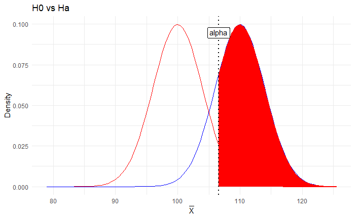
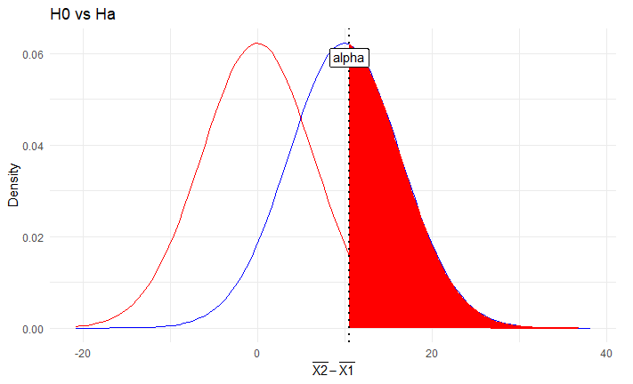

<center> <h1>Tarea 3: Frequentist Inference II </h1> </center>
<center><strong>CC6104: Statistical Thinking</strong></center>
#### **Integrantes :** 

- Rafael De La Sotta
- Felipe Ortúzar

#### **Cuerpo Docente:**

- Profesor: Felipe Bravo M.
- Auxiliar: Sebastian Bustos e Ignacio Meza D.
            

#### **Fecha límite de entrega:**

### **Índice:**

1. [Objetivo](#id1)
2. [Instrucciones](#id2)
3. [Referencias](#id3)
2. [Primera Parte: Preguntas Teóricas](#id4)
3. [Segunda Parte: Elaboración de Código](#id5)

### **Objetivo**<a name="id1"></a>

Bienvenid@s a la tercera tarea del curso Statistical Thinking. Esta tarea tiene como objetivo evaluar los contenidos teóricos de la segunda parte del curso, los cuales se enfocan principalmente en el diseño de experimentos, test de hipótesis y regresión lineal. Si aún no han visto las clases, se recomienda visitar los enlaces de las referencias.

La tarea consta de una parte teórica que busca evaluar conceptos vistos en clases. Seguido por una parte práctica con el fin de introducirlos a la programación en R enfocada en el análisis estadístico de datos. 

### **Instrucciones:**<a name="id2"></a>

- La tarea se realiza en grupos de **máximo 2 personas**. Pero no existe problema si usted desea hacer de forma individual.
- La entrega es a través de u-cursos a más tardar el día estipulado en la misma plataforma. A las tareas atrasadas se les descontará un punto por día.
- El formato de entrega es este mismo **Rmarkdown** y un **html** con la tarea desarrollada. Por favor compruebe que todas las celdas han sido ejecutadas en el archivo html.
- Al momento de la revisión tu código será ejecutado. Por favor verifica que tu entrega no tenga errores de compilación.
- No serán revisadas tareas desarrolladas en Python.
- Está **PROHIBIDO** la copia o compartir las respuestas entre integrantes de diferentes grupos.
- Pueden realizar consultas de la tarea a través de U-cursos y/o del canal de Discord del curso. 


### **Referencias:**<a name="id3"></a>

Slides de las clases:

- [Design of Experiments & Hypothesis Testing](https://github.com/dccuchile/CC6104/blob/master/slides/ST-hypothesis.pdf)
- [Linear Regression](https://github.com/dccuchile/CC6104/blob/master/slides/ST-regression.pdf)

Enlaces a videos de las clases:

- Design of Experiments & Hypothesis Testing: [video1](https://youtu.be/3MueyHnNNig) [video2](https://youtu.be/JuyIrya23E0) [video3](https://youtu.be/OXTyG6DIvK4) [video4](https://youtu.be/95QeSwrNoLI) [video5](https://youtu.be/ZCr3WCdc-54) [video6](https://youtu.be/T6ZR0KoKhBQ)
- Introduction to Statistical Inference: [video1](https://youtu.be/ZLZXJPKH6tU) [video2](https://youtu.be/mW7bHkJBcB4) [video3](https://youtu.be/SHa5Neb7bfg) [video4](https://youtu.be/rCD_jofxecY) [video5](https://youtu.be/ir4P_f3s44g) [video6](https://youtu.be/wfNhJWHPOi8)


# Primera Parte: Preguntas Teóricas<a name="id4"></a>
A continuación, se presentaran diferentes preguntas que abordan las temáticas vistas en clases. Por favor responda cada una de estas de forma breve.

#### **Pregunta 1:**
Determine si las siguientes regresiones son lineales para los parámetros $\beta_{i}$

- [ ] $y(x) = \beta_{0} + \beta_{1} x$

- [ ] $y(x) = \beta_{0} + \beta_{1} x + (\beta_{3}+x)^{3}$

- [ ] $y(x) = \ln(x^{2}+\beta_{0})$

> Para que una expresión multivariable sea lineal se debe asegurar que pueda ser expresada de forma matricial, $Y = X \beta$. 

> En el primer caso, $y(x) = \beta_{0} + \beta_{1} x$ puede ser expresada como:
$$ Y(x) =  \left( \begin{array}{ll} \beta_{0} \\ \beta_{1} \end{array} \right)^T \left( \begin{array}{ll} 1 \\ x \end{array} \right) $$

> Para el caso dos, este tiene a $\beta^2$ y $\beta^3$, como consecuencia del cubo del binomio. Con esto valores es imposible expresar la función como $Y = X \beta$.

> Para el caso tres, este tiene una función logarítnica que impide separar a $\beta_{0}$ del resto de las expresiones y tambien impide expresar a la función como $Y = X \beta$.

#### **Pregunta 2:**
Una universidad esta interesada en saber cuantos alumnos gustan del anime, para esto realiza una recopilación de datos y llega a la construcción del siguiente modelo lineal simple:

$$\hat{N°\_de\_fanaticos\_del\_anime}=300+90*numero\_de\_semestres$$

¿Como podemos interpretar el intercepto y pendiente del modelo?, ¿El intercepto y la pendiente tienen una interpretación coherente para cualquier modelo lineal?, si no es así, de un ejemplo.

> El intercepto sería la cantidad de estudiantes, fánaticos del anime, que todavían no han cursado algún semestre en la universidad (0 semestres; proto-mechones coloquialmente). Y la pendiente sería cuánto aumenta la cantidad de estudiantes fanáticos del anime por cada semestre cursado en la universidad.
En modelos de la vida real hay que tener cierto cuidado en los límites del modelo lineal, esto es, cuando el dominio o el recorrido valen 0. Por ejemplo, si una panadería tiene este modelo lineal para sus ventas: #Ventas = 100 + 10 * #Panes cocinados, entonces, eso significa que cuando no cocinan panes tienen 100 ventas? No, y es en casos como estos en donde se pierde la interpretación del modelo lineal. 


#### **Pregunta 3:**
Considere un test con dos muestras no aparejado, explique porque se hace una corrección a los grados de libertad en el test de Welsh.

> El test de Welsh se utiliza para, al asignar grados de libertad, "castigar" diferencias entre números de conjuntos de test de dos muestras. Si se utilisa el métono común (n-m) no influiye que cantidad de datos tiene cada conjunto, siendo esto de extrema relevancia para casos desiguales.

> Por ejemplo, si se tiene un test de dos muestras donde una muestra tiene muchos datos y la otra muy pocos. Para el método común, se tendría una gran confianza en los datos dado la cantidad total de los datos, lo cual, como sabemos, no sería correcto.


#### **Pregunta 4:**

Al realizar una regresión lineal simple con una variable categórica $(\beta_{0} + \beta_{1} \cdot \text{categroica})$  ¿que interpretación puede obtenerse del coeficiente que acompaña a la variable categórica?


> La interpretación de la variable $\beta_{1}$ es que corresponde a la diferencia entre valores de cada grupo en esa categoría. Por ejemplo, en un dataset con una categoría de "deportistas" y "no deportistas", una columna "proteína diaria ingerida" y otra "masa muscular", y considerando la función lineal: $Masa \, muscular = \beta_{0} + \beta_{1} \cdot proteína \, diaria \, ingerida$, entonces $\beta_{1}$ sería igual a la diferencia entre la proteína diaria ingerida de los deportistas y los no deportistas. Cabe destacar que la interpretación de $\beta_{1}$ en el modelo implica que se está realizando un test de hipótesis sobre las variables que definen a la variable objetivo.

#### **Pregunta 5:**
Discuta la siguiente frase:

"
Hacer una regresión lineal mediante máxima verosimilitud requiere tener ciertas hipótesis probabilisticas de los datos, mientras que una regresión realizada mediante mínimos cuadrados no necesita tener ninguna hipótesis probabilista.
"

> Es importante saber que ambos métodos son equivalentes. En una regresión lineal la máxima verosimilitud se alcanza solo si se minimiza el error cuadratico medio, y vice versa. De hecho, por medio del método de máxima veosilitud se obtiene que se debe minimizar el error cuadrático en una regresión, y para esto se asume la distribución del error de esta. Y para utilizar este método se realizan asumen los siguientes puntos:

  * Linealidad de los datos
  * error con distribución gausiana
  * varianza del error constante
  * Error independiente

> Como consecuencia de todo lo anterior, podemos decir que al utilizar la minimización del error cuadrado se están haciendo las mismas hipótesis realizadas para linealizar mediante máxima verosimilitud.

#### **Pregunta 6:**

Explique porque el test de significancia sobre los parámetros de una regresión lineal se realiza bajo la hipótesis nula $\beta_{H_{0}}=0$.

> Principalmente porque se desea *rechazar* la hipótesis nula de que $\beta_{H_{0}}=0$ para $\beta_0$ o "intercepto" y $\beta_1$ o "la pendiente". Entonces, al rechazar la hipótesis nula de que $\beta_0 = 0$ se está "diciendo" que al inicio de la función, en $x=0$, el valor es muy diferente de 0 con cierto nivel de confianza. Por otro lado, al rechazar la hipótesis nula de que $\beta_1 = 0$, significa que existe una relación lineal entre la variable y el objetivo.


#### **Pregunta 7:**

¿Que nos dice la equivalencia de la máxima verosimilitud sobre los parámetros que componen una regresión lineal? ¿Qué nos permitirían calcular?

> Asumiendo que el error entre la regresión lineal y los valores reales tiene un distribución gaussiana, se busca la máxima verosimilitud para este, la cual se alcanza cuando la suma de los errores cuadraticos es mínima. 

> Luego, los parámetros de linealización son escogidos de acuerdo a minimizar el error cuadrático medio. 


> Por ejemplo, para una regresión simple, se quiere tiene la siguiente linealización:

$$
h(x) = \beta_{0} + \beta_{1} \cdot x
$$

> Los parámetros escogidos deben ser los que minimicen el error cuadratico entre los datos reales y, y h(x).

$$
SSE = \sum_{i}^{n}(y - h(x))
$$

> En este caso, los parámetros que minimizan este errro son los siguientes: 

$$
\hat{\beta_{1}} = \frac{\sum_{i}^{n}(x_i - \bar{x}) (y_i - \bar{y})}{\sum_{i}^{n}(x_i - \bar{x})^2}
$$

$$
\hat{\beta_{0}} = \bar{y} - \hat{\beta_{1}} \cdot \bar{x}
$$


### **Pregunta 8**

Consideremos una regresión lineal de una variable. En vez de mínimos cuadrados es posible minimizar la expresión

$$
\displaystyle{\sum_{i=1}^{n}}|y_{i}-\beta_{0}-\beta_{1}x_{i}|
$$
Explique en que se diferencia con mínimos cuadrados, de una posible ventaja y desventaja de este método (en comparación a mínimos cuadrados).

>En primer lugar, hay que analizar qué ocurre cuando intentamos resolver analíticamente la solución de encontrar el mínimo error. Lamentablemente no existe una solución analítica debido a la presencia de la función absoluto sobre los betas. En particular, $\beta_0$ no tiene solución ($-n = 0$ o$n = 0$) y hay que cambiar la aproximación de la solución a una de carácter iterativo. Estos dos problemas, (1) sin solución analítica y (2) cálculo de la solución de manera iterativa, se consideran desventajas. Además es posible que existan múltiples soluciones, dependiendo de los datos.

>Por otro lado, el uso de valor absoluto para el cálculo del error constituye una ventaja, al presentar mayor robustez frente a $\textit{outliers}$, ya que valores extremadamente grandes en comparación a la media ya no van a generar desviaciones aún mayores (al quedar al cuadrado).


#### **Pregunta 9:**
Explique porque el coeficiente $R^2$ tiende a crecer con el numero de variables.

> Existen muchas maneras de expresar este termino, una de ellas es $R^{2} = 1 - \frac{SSE}{SST}$. Tal como sabemos, el término a minimizar corresponde a SSE, por lo que este, si bien aumenta constantemente, al ser la variable minimizada debiese aumentar a una tasa menor que SST, el cual no es controlado por la regresión y tambien aumenta constantemente.

> Dicho esto, se entiende que $\frac{SSE}{SST}$ tiende a decrecer, y producto de esto R tiende a aumentar su valor.


#### **Pregunta 10**

Un estudio de cáncer realizado por la institución X ha señalado que las personas que beben café poseen mayores probabilidades de padecer algún cáncer pulmonar.  El estudio causo un gran revuelo en la población, por lo que una segunda institución ha decidido replicar el experimento, llegando a la conclusión que las personas que toman café tienden a fumar cigarrillos mientras beben esta bebida. Señale que tipo de variable serían los fumadores de cigarrillos en el estudio de cáncer pulmonar y explique cual es la característica de estas variables.

> En este caso los fumadores de cigarrillos corresponde a una *variable de confusión*. Las variables de confusión son factores que no son claros al iniciar un experimento, pero al ser identificadas explican la relación entre otras dos o más variables que "inexplicablemente" estaban relacionadas, y esta variable de confusión es aquella que explica la conexión.

---

# Segunda Parte: Elaboración de Código<a name="id5"></a>

En la siguiente sección deberá resolver cada uno de los experimentos computacionales a través de la programación en R. Para esto se le aconseja que cree funciones en R, ya que le facilitará la ejecución de gran parte de lo solicitado.

Para el desarrollo preste mucha atención en los enunciados, ya que se le solicitará la implementación de métodos sin uso de funciones predefinidas. Por otro lado, Las librerías permitidas para desarrollar de la tarea 3 son las siguientes:

```{r, eval=FALSE}
# Manipulación de estructuras
library(tidyverse)
library(dplyr)
library(tidyr)

# Para realizar plots
#library(scatterplot3d)
library(ggplot2)
library(plotly)

# Manipulación de varios plots en una imagen.
library(gridExtra)
```


## Z-test

En clases se han visto diferentes tipos de test de hipótesis para demostrar una proposición sobre algún parámetro. Uno de los test vistos en clases es el Z-Test, el cual su distribución del test estadístico bajo la hipótesis nula se puede aproximar a una Gaussina.  Para la aplicación de este test, resaltan los siguientes puntos:

-	Cada uno de los puntos de la muestra deben ser independientes unos de otros.
-	Al utilizar una distribución normal en la hipótesis nula, este test debería utilizarse cuando se tiene un número considerable de observaciones, ya que la sampling distribution de la media tiende a una gaussiana, de lo contrario se debería usar un T-test.

Para calcular la 	significancia estadística al igual que con otros métodos esta se debe calcular como:

-	Menor/Cola-Izquierda (one-tailed):  La Hipótesis Nula H0: $\mu \geq \mu0$ vs Hipótesis Alternativa H1: $\mu < \mu0$.
-	Superior/Cola-Derecha (one-tailed): La Hipótesis Nula H0: $\mu \leq \mu0$ vs Hipótesis Alternativa H1: $\mu > \mu0$.
-	Dos-Colas/Two-tailed: Hipótesis Nula H0: $\mu = \mu0$ vs Hipótesis Alternativa H1: $\mu \neq \mu0$.

Luego, dependiendo del objetivo del test tenemos las metodologías one-sample y two-sample. Utilizaremos One-Sample cuando nuestro objetivo es comparar la media de una muestra con la media de la población. El Z-score del One-Sample se define como:

$$Z-score_{One-Sample} = \dfrac{\bar x - \mu}{\dfrac{\sigma}{\sqrt n}}$$
Donde $\bar x$ es la media de la muestra, $\mu$ es la media de la población, $\sigma$ es la desviación estándar de la población y $n$ es el tamaño de la muestra.

Por otro lado, se utiliza Two-Sample cuando queremos comparar la media de dos muestras. El Z-score de Two-Sample se define con la ecuación:

$$Z-score_{Two-Sample} = \dfrac{(\bar x_2 - \bar x_1) - (\mu_1 - \mu_2)}{\sqrt{\dfrac{\sigma_1^2}{n_1}+\dfrac{\sigma_2^2}{n_2}}}$$	
Donde $(\bar x_2 - \bar x_1)$ es la diferencia de las medias de la muestra, $(\mu_1 - \mu_2)$ la diferencia de las medias de la población, $\sigma_{1,2}$ la desviación estándar de la población y $n_{1,2}$ el tamaño de las muestras.

## Multiples Test

En la práctica aparece la necesidad de testear múltiples hipótesis (por ejemplo en biología se pueden utilizar múltiples grupos de control o querer estudiar múltiples resultados de un mismo experimento), de esta forma la primera idea es testear individualmente cada una de las hipótesis, el problema de este enfoque es que la probabilidad de que se obtenga al menos un resultado significante crece rápidamente (con un nivel de significancia $\alpha = 0.05$ y $20$ test ya se alcanza una probabilidad de $64\%$ de tener resultados significantes por azar).

Una forma de corregir los inconvenientes del método anterior es utilizar el método de **Bonferroni correction** quien propone cambiar $\alpha$ por $\alpha/m$ (donde $m$ es la cantidad de test de hipotesis realizados), esto resulta que las probabilidades de rechazar por error se mantengan bajas. De esta forma los p-valores obtenidos en un test de hipótesis y al utilizar Bonferroni correction, quedan dados por el producto de un $p-valor_{i}$ y la cantidad de test realizados: $\text{p-valor}_{i}*m$.

### Pregunta 1: "I´ve Got The Power!"
El objetivo de esta pregunta es programar la potencia de un test de hipótesis y observar como se comportan las la hipótesis nula v/s la alternativa para un Z-test. Con el desarrollo de este ejercicio, podrán visualizar las diferentes partes que conforman a un test de hipótesis, identificar que es el p-valor y evidenciar como varia la potencia de un test one-sample y two-sample al variar $\alpha$.

Para recordar; sabemos que en estadística el concepto de potencia viene dado por:

$$Power = 1 - \beta$$

Donde $\beta$ es la probabilidad de obtener un error de tipo II. Con esto, la potencia estadística viene a representar la probabilidad de rechazar la hipótesis nula cuando esta es falsa. O sea, la potencia de una prueba es la probabilidad de encontrar un resultado positivo dado que este existe. 
Una de las formas de representar la potencia de un test es a través del siguiente gráfico:


</p>

Del gráfico, es posible visualizar que a medida que aumenta la diferencia en la media de la población, se obtienen mayores valores de potencia estadística.

Recordada que es la potencia de un test de hipótesis, a continuación, usted deberá programar una función que sea capaz de obtener la potencia de un Z-test one-sample y two-sample. Para esto por favor considere los siguientes puntos:

-	Crear una función que posea los siguientes argumentos:

```r
    function(n1=NULL, sigma1=0.5, 
    n2=NULL,sigma2=0.5, mu.Ha=0 , 
    mu.True=0, alfa=0.05)
```

  De los argumentos, tendremos que: $n1$ representa la cantidad de datos para la muestra 1, $sigma1$ es la desviación estándar de la muestra 1, $n2$ la cantidad de datos para la muestra 2, $sigma2$ la desviación estándar para la muestra 2, $mu.Ha$ el mu del test de hipótesis y $mu.True$ la media de la población real. Notar que la presencia de una segunda muestra solo es para el caso two-sample, para el caso one-sample el argumento de entrada $n2$ debería ser nulo.

-	La función creada debe ser capaz de calcular el Z-test con el método One-sided (utilice solo la cola superior de la alternativa one-sided). Notar que la función al recibir un argumento nulo en $n2$ debería asumir que se trata de un test one-sample automáticamente.
- Al recibir un valor no nulo para $n2$, $mu.Ha$ representará la diferencia entre las medias de las muestras y $mu.True$ la diferencia de las medias de la población de las muestras 1 y 2.
-	La salida de la función deberá retornar la potencia del test y un plot de las gaussianas que conforman el test de hipótesis. Para el caso del plot, observe los ejemplos de plot dispuestos más abajo.

<details>
<summary>Plots One-Sample y Two-Sample</summary>
<p>

Plot One-Sample



Plot Two-Sample



Para los plots deberían obtener algo similar a las figuras expuestas, donde en los plots se pueden ver las hipótesis que componen el test y el área roja bajo la curva representa la potencia del test. 

</p>
</details>
<p>
</p>


- Si utiliza el esqueleto propuesto, complete y comente que realiza cada una de las partes de la función one-sample entregada.

Codificada la función realice los siguientes experimentos:

-	Obtener el gráfico de potencia al variar la media poblacional para los siguientes argumentos de entrada:

$$ n1=16, sigma1=16, mu.Ha=100 , mu.True=Variar, alfa=0.05 $$
$$ n1=16, sigma1=16, mu.Ha=100 , mu.True= Variar, alfa=0.01 $$
$$ n1=16, sigma1=16, mu.Ha=100 , mu.True= Variar, alfa=0.1 $$

Se le recomienda que la variación se realice a través de un `for` y grafique las curvas dentro de un mismo gráfico para observar potenciales diferencias entre ellas.

-	Diseñe un experimento one-sample y visualice cómo se comportan las distribuciones normales de la hipótesis nula y la hipótesis alternativa al variar $\alpha$.

-	Diseñe un experimento Two-sample y visualice cómo se comportan las distribuciones normales de la hipótesis nula y la hipótesis alternativa al variar $\alpha$.

Para el diseño de experimentos y/o comprobación de sus métodos puede serles útiles (no hay problema si decide utilizar los mismos ejemplos):

- one-sample: [Power Functions](https://online.stat.psu.edu/stat415/lesson/25/25.2)
- Two-Sample: [Simple Power Calculation for Two-Sample Z Test](https://ytliu0.github.io/Stat_Med/power2.html)

**Respuesta**
```{r, eval=TRUE}
library(ggplot2)
# Power Function, El esqueleto posee como ejemplo como obtener la potencia de un z-test one-sample.
# Si utiliza este esqueleto deberá comentar la función que cumple cada una de las partes entregadas
power.z.test <- function(n1=NULL, sigma1=0.5, 
                         n2=NULL,sigma2=0.5, mu.Ha=0 , 
                         mu.True=0, alfa=0.05){
  Z = qnorm(1-alfa)
  
  if(is.null(n2)){
    # Se calcula el valor del test estadístico Z, para alpha, para ver cuándo rechazar el test de        hipotesis nula
    
    
    #se obtiene el aproximado de la dev std de la poblacion (que termina siendo el de la muestra)
    denominador = sigma1/sqrt(n1)
    #se obtiene el valor para rechazar la hip nula en los datos
    X_bar = Z*denominador + mu.Ha
    
    # se obtiene la diferencia entre el valor de rechazo y el valor de la media
    numerador = X_bar - mu.True
    
    Z = numerador/denominador
    x_label <- expression(bar("X"))
    # se calcula la probabilidad de rechazar la hipotesis nula p = 1 - beta
    Power = 1 - pnorm(Z)
    

  }
  if(!is.null(n2)){
    
    #n1=NULL, sigma1=0.5,n2=NULL,sigma2=0.5, mu.Ha=0 , mu.True=0, alfa=0.05
    # Calculamos el error estandar de ambas distribuciones
    denominador = sqrt((sigma1^2)/n1 + (sigma2^2)/n2)
    
    # mu.Ha representará la diferencia entre las medias de las muestras
    # mu.True la diferencia de las medias de la población de las muestras 1 y 2.
    
    # Z-score = mu.Ha / error standard
      Z_score = mu.Ha / denominador
      
      X_bar = Z*denominador + mu.Ha
      
      Power = 2*pnorm(-abs(Z_score))
    
      x_label <- expression(bar(X2) - bar(X1))
    # 
    plot = NULL # Solo esta null para que puedan ejecutarlo.
  
  }
    
    
        # Calculamos el mínimo y máximo de la distribucion normal con media mu.ha y sd = se
    min_lim = min(rnorm(1000, mean=mu.Ha, sd=denominador)) - 
      round(min(rnorm(1000, mean=mu.Ha, sd=denominador)))%%10
    max_lim = max(rnorm(1000, mean=mu.True, sd=denominador)) +
      round(max(rnorm(1000, mean=mu.True, sd=denominador)))%%10
      
    # Generamos el plot con las curvas de la distribucion normal de la poblacion y la muestra
    plot <- ggplot(data.frame(x = c(min_lim, max_lim)), aes(x)) + 
      stat_function(fun = dnorm, args = list(mean = mu.Ha, sd = denominador), 
                    col='red') +
      stat_function(fun = dnorm, args = list(mean = mu.True, sd = denominador), 
                    col='blue') +
      stat_function(fun = dnorm, args = list(mean = mu.True, sd = denominador), 
                    xlim = c(X_bar,max_lim), geom = "area", fill='red') + 
      geom_vline(xintercept = X_bar, linetype="dotted", size=1) +
      annotate(x=X_bar, y=+Inf,label="alpha", vjust=2, geom="label") +
      theme_minimal() +
      ggtitle("H0 vs Ha") +
      xlab(x_label) +
      ylab("Density")

  # Como R no permite retornar dos salidas usamos una lista
  # Los resultados se llaman con $plot o $power
  return(list(plot=plot, power=Power))
}


```

### Gráficos one-sample usando varios ejemplos modificando alpha. Se usó y modificó ligeramente el esqueleto de ejemplo.

```{r, eval=TRUE}
one_sided <- power.z.test(n1=16, sigma1=16, mu.True=8, alfa=0.01)
one_sided2 <- power.z.test(n1=16, sigma1=16, mu.True=8, alfa=0.05)
one_sided3 <- power.z.test(n1=16, sigma1=16, mu.True=8, alfa=0.1)
plot(one_sided$plot)
plot(one_sided2$plot)
plot(one_sided3$plot)
```

### Gráficos two-sample usando varios ejemplos modificando alpha.
```{r, eval=TRUE}
two_sided <- power.z.test(n1=16, sigma1=16, n2=40, sigma2 = 25, mu.Ha=100 , mu.True=110, alfa=0.01)
two_sided2 <- power.z.test(n1=16, sigma1=16, n2=40, sigma2 = 25, mu.Ha=100 , mu.True=110, alfa=0.05)
two_sided3 <- power.z.test(n1=16, sigma1=16, n2=40, sigma2 = 25, mu.Ha=100 , mu.True=110, alfa=0.1)
plot(two_sided$plot)
plot(two_sided2$plot)
plot(two_sided3$plot)
```


## Experimentos one_tail variando alfa y mu.Ha *usando el esqueleto propuesto*. 

```{r, eval=TRUE}
lista2 <- c()
lista3 <- c()
lista4 <- c()

for (val in c( 85:125)){
  uw <-  power.z.test(n1=16, sigma1=16, mu.Ha=100 , mu.True=val, alfa=0.01)
  uw1 <- power.z.test(n1=16, sigma1=16, mu.Ha=100 , mu.True=val, alfa=0.05)
  uw2 <- power.z.test(n1=16, sigma1=16, mu.Ha=100 , mu.True=val, alfa=0.1)
  lista2 <- c(lista2, uw$power)
  lista3 <- c(lista3, uw1$power)
  lista4 <- c(lista4, uw2$power)
} 
df_lista <- data.frame(mu_True = c( 85:125), 
                       p_value_001 = lista2, 
                       p_value_005 = lista3, 
                       p_value_01 = lista4)

ggplot() + 
    geom_line(data=df_lista, aes(x = mu_True, y = p_value_001, color="0.01"),   size=1) +
  geom_line(data=df_lista, aes(x = mu_True, y = p_value_005, color="0.05"), size=1) +
  geom_line(data=df_lista, aes(x = mu_True, y = p_value_01,  color="0.1"),  size=1) + 
  xlab("Diferencia de las medias de la población entre x1 y x2") +
  ylab("p-value") +
  scale_color_manual(name = "Alpha", values = c("0.01"= "red", "0.05"= "green", "0.1"= "blue"))


```

---

### Pregunta 2: Z-test
Esta pregunta tiene como objetivo comprender como funciona un test de hipótesis y como deberíamos abordar la realización de múltiples test de hipótesis con datos reales.

La pregunta deberá ser desarrollada utilizando el dataset `marketing_campaign.csv`. Con esto, deberá programar un Z-test, con el cual estudiará a través de experimentos el `Income` de personas con los grados académicos `Graduation`, `Master` y `PhD`. Para realizar esto considere la elaboración de los siguientes puntos de forma secuencial:

- Modificar el dataframe entregado generando un estructura apta para el test de hipótesis. Una estructura que se les aconseja utilizar son vectores con los valores que representan a los grados académicos `Graduation`, `Master` y `PhD` por separado.

<details>
<summary>Ejemplo de estructura</summary>
<p>

Por ejemplo para el caso de Graduation pueden generar estructuras de la siguiente forma:

| ID   | Graduation |
|------|------------|
| 5524 | 58138      |
| 2174 | 46344      |
| 4141 | 71613      |
| 6182 | 26646      |
| 965  | 55635      |
| ...  | ...        |

Donde los valores en la fila de Graduation representan los sueldos de las diferentes personas que conforman el dataset. Un punto importante a considerar es que los datos para los diferentes grados académicos poseen diferentes numero de datos (no se asusten por esto).

</p>
</details>
<p>
</p>

- Programar el método Z-test con la metodología one sample y two sample, obteniendo los p-valores a través de las alternativas one-sided y two-sided. Para el caso de one-sided, cree una función capaz de obtener la cola menor y mayor de la gaussiana.

- El calculo de las diferentes alternativas para calcular los p-valores deberá ser un argumento de su función, donde señalando 'menor','mayor' (para los casos one-sided) y 'two-sided' deberá obtener el valor pertinente para cada caso.

- Genere una función que permita realizar solo múltiples test del tipo two-sample y aplique bonferroni correction a los p-valores obtenidos. Notar que los múltiples test deberá realizar la comparación entre todos los elementos de entrada, por ejemplo si deseamos comparar los ingresos de `Graduation`, `Master` y `PhD`, se deberían comparar los ingresos de `Graduation` v/s `Master`, `Graduation` v/s `PhD` y `Master` y `PhD`

Codificada las funciones, realice los siguientes experimentos con su función de test de hipótesis:

- Compruebe si la media de los ingresos para la variable `Graduation` es similar a 52000. Señale formalmente este experimento y obtenga los p-valores para las alternativas one-sided y two-sided.

- Compruebe si la diferencia entre los ingresos de las personas con el grado académico `Graduation` es cercana a cero en relación a la recibida por los `Master` y `PhD`. Para este punto utilice la función que le permite realizar múltiples test del tipo two-sample.

Para los diferentes experimentos considere que la desviación estandar de la población para los diferentes `income` son los siguientes:

$$\sigma_{Graduation} = 28180$$
$$\sigma_{Master} = 20160$$
$$\sigma_{PhD} = 20615$$

**Respuesta:**

```{r, eval=TRUE}
df = read.csv('marketing_campaign.csv', sep='\t')

# Implementación de Z-test one-sided y two-sided
# Puede utilizar este esqueleto
z_test <- function(data1=NULL, sigma1=0.5, data2=NULL, sigma2=0.5, 
                   mu.Ha=0, test.type = c('one-sided','two-sided'),
                   verbose=TRUE){
  
  if(length(test.type)>=2){
    print("Por favor escoge un tipo de Test: ´one-sided´ o ´two-sided´ ")
    return()
  }
  else if(length(test.type)==1 && !(test.type %in% c('menor','mayor','two-sided'))){
    print("Por favor escoge un tipo de Test: ´menor´, ´mayor´ o ´two-sided´")
    return()
  }
  else if(is.null(data2)){
    mu_1 = mean(data1, na.rm=TRUE)
    n_1 = length(data1)
    Z_score = (mu_1 - mu.Ha)/(sigma1/sqrt(n_1))
    # P-value
    if(test.type=='menor'){
      p_value = pnorm(Z_score)
    }
    else if(test.type=='mayor'){
      p_value = 1 - pnorm(Z_score)
    }
    else if(test.type=='two-sided'){
      if(mu_1>=mu.Ha){
        p_value = (1 - pnorm(Z_score))*2
      }
      else if(mu_1<mu.Ha){
        p_value = (pnorm(Z_score))*2
      }
    }
    # Texto de Salida
    if(verbose){
      cat("\tOne-sample Z-Test:\n\nData analizada:",
                      deparse(substitute(data1)), "\nZ=", Z_score, 
                      "P-value=", p_value, "\n\n",sep=" ")
    }
    
    return(p_value)
    
  }
  else if(!is.null(data2)){
    # Hypothesis test
    mu_1 = mean(data1, na.rm=TRUE)
    mu_2 = mean(data2, na.rm=TRUE)
    n_1 = length(data1)
    n_2 = length(data2)
    Z_score = (mu_2 - mu_1)/sqrt(((sigma1^2)/n_1 +  (sigma2^2)/n_2))
    # p-value
    if(test.type=='menor'){
      p_value = pnorm(Z_score)
    }
    else if(test.type=='mayor'){
      p_value = 1 - pnorm(Z_score)
    }
    else if(test.type=='two-sided'){
      if(Z_score>=0){
        p_value = (1 - pnorm(Z_score))*2
      }
      else if(Z_score<0){
        p_value = pnorm(Z_score)*2
      }
    }
    # Texto de Salida
    if(verbose){
      cat("\tTwo-sample Z-Test:\n\nData analizada:",
                      deparse(substitute(data1)),"y",
                      deparse(substitute(data2)), "\nZ=", 
                      Z_score, "P-value=", p_value, "\n\n",sep=" ")
    }
  
    return(p_value)
  }
}
```


```{r, eval=TRUE}
vec_income_PhD <- df[df$Education == 'PhD', ]$Income
vec_income_Master <- df[df$Education == 'Master', ]$Income
vec_income_Graduation <- df[df$Education == 'Graduation', ]$Income

sigma_PhD = 20615
sigma_Master = 20160
sigma_Graduation = 28180


z.test.multiple_testing <- function(){
  print('Comprobar si la media de los ingresos para la variable Graduation es similar a 52000.')
  p_value_1 = z_test(data1=vec_income_Graduation, sigma1=sigma_Graduation, mu.Ha=52000, test.type='two-sided', verbose=TRUE)

  print('Compruebe si la diferencia entre los ingresos de las personas con el grado académico `Graduation` y `Master` es cercana a cero')
  p_value_2 = z_test(data1=vec_income_Graduation, sigma1=sigma_Graduation, data2=vec_income_Master, sigma2=sigma_Master, test.type='two-sided', verbose=TRUE)

  print('Compruebe si la diferencia entre los ingresos de las personas con el grado académico `Graduation` y `PhD` es cercana a cero')
  p_value_3 = z_test(data1=vec_income_Graduation, sigma1=sigma_Graduation, data2=vec_income_PhD, sigma2=sigma_PhD, test.type='two-sided', verbose=TRUE)
}
```

**Distribuciones**

Antes de hacer el test se muestran las curvas de ingresosos utilizadas, esto con el fin de tener un mejor entendimiento de los resultados. Además, visualizar los datos ayuda a corroborar el sentido de estos.

```{r, eval=TRUE}

mean_income_PhD = mean(vec_income_PhD, na.rm=TRUE)
mean_income_Master = mean(vec_income_Master, na.rm=TRUE) 
mean_income_Graduation = mean(vec_income_Graduation, na.rm=TRUE)

length_income_PhD = length(vec_income_PhD)
length_income_Master = length(vec_income_Master) 
length_income_Graduation = length(vec_income_Graduation)


x <- seq(0,140000,length=1000)
plot(x, dnorm(x,mean=mean_income_Graduation,sd=sigma_Graduation), type = "l",lty=1,lwd=3, col = "blue", xlim=c(0,140000), ylim=c(0,0.00003), ylab = "Probabilidad", xlab = "Income", main="Distribuciones de sueldos según grado académico")
lines(x, dnorm(x,mean=mean_income_Master,sd=sigma_Master), type = "l", col = "orange")
lines(x, dnorm(x,mean=mean_income_PhD,sd=sigma_PhD), type = "l", col = "red")

legend(100000, 0.00003, legend=c("Graduation", "Maste", "PhD"),
       col=c("blue", "orange","red"), lty=1:2, cex=0.8)

```

**Test**
Se realiza el multitest definido anteriormente.

```{r, eval=TRUE}
z.test.multiple_testing()
```

Como resputado del test se tienen los siguientes resultados

* Se rechaza que los valores estén distanciados. Se concluye que la variable Graduation es similar a 52000.
* Se rechaza que los valores estén distanciados. Se concluye que la variable Graduation es similar a la variable Magister.
* Se acepta que los valores están distnaciados. Se concluye que la variable Graduation es diferente a la variable PhD.


### Pregunta 3: Testeando multiples hipotesis y Bonferroni Correction

El objetivo de este problema es estudiar como realizar múltiples test de hipótesis simultáneamente. Para esto en primer lugar se estudiara el método "intuitivo", donde veremos sus limitantes y se comparará con el método llamado **Bonferroni correction**, posteriormente se realizará un estudio practico con el dataset `ratones.csv`.

Un investigador se ha colocado en contacto con ustedes señalándoles que realiza diariamente test de hipótesis entre las muestras que toma día a día en su laboratorio. Con esto, al investigador le urge saber si realizar multiples test de hipótesis sin una corrección podría afectar la toma de decisiones. Para comprobar esto, les solicita comprobar matemáticamente como se comporta la probabilidad de obtener al menos un resultado significativos al azar de sus experimentos diarios. Para esto, les señala que la la probabilidad de obtener un experimento por azar puede ser simulado a través de los casos exitosos de una binomial (valores mayores a cero), donde el numero de observaciones son la cantidad de experimentos ($m$) y la probabilidad queda dada por $\alpha$ del test.

A continuación, se entregan unas indicaciones mas especificas para desarrollar la pregunta:

- [ ] Complete el código presentado a continuación que le permite calcular la probabilidad empírica de que obtenga al menos un resultado significativo para significancia $\alpha$ y cantidad de experimentos $m$ arbitrarios.
- [ ] Se puede verificar que para un nivel de significancia $\alpha$ y $m$ experimentos independientes la probabilidad de que se tenga al menos un resultado significativo por azar es 
$$\mathbb{P}(\text{obtener al menos resultado significativo por azar})=1-(1-\alpha)^{m}$$
- [ ] Considere $\alpha = 0.05$, grafique la probabilidad empírica y real variando el valor de $m$ ¿Se parecen sus resultados? ¿Que sucede cuando la cantidad de experimentos crece mucho? ¿Este comportamiento depende del valor de significancia $\alpha$? ¿Es útil este método para la realización de múltiples test de hipótesis?
- [ ] Para solucionar los inconvenientes del método anterior es posible utilizar el método de **Bonferroni correction**, modifique su código anterior para verificar lo anterior ¿Mejoran los resultados? ¿cual podría ser un problema si es que $m$ es muy grande?
- [ ] Ejecute el siguiente código que calcula el $p$-valor usual y el $p$-valor asociado a Bonferroni (que corresponde al $p$-valor * m donde $m$ es el numero de experimentos), ¿Cuantos valores que originalmente se hubieran aceptado fueron rechazados si $\alpha = 0.05$? ¿Que implica esto sobre el nivel de falsos negativos de este metodo?


```{r, eval=TRUE}
data <- read.csv("ratones.csv",sep= ";", stringsAsFactors = T)
data$p.value <- sub(",",".",data$p.value)
data$p.value <- as.numeric(data$p.value)
data$p.value.Bonferroni <- sub(",",".",data$p.value.Bonferroni)
data$p.value.Bonferroni <- as.numeric(data$p.value.Bonferroni)
head(data)
```

**Respuesta Aquí:**

A continuación se tiene la función para calcular la probabilidad empírica de obtener un resultado signifiativo. Esta probabilidad depende del umbral del p valor ($\alpha$), el número de muestras (m), el número de experimentos (n) y el tipo de p valor utilizado (normal o Bonferroni). 

```{r, eval=TRUE}
probEmpirica <- function(alpha,m,n=100, Bonferroni = FALSE){
  if (Bonferroni){
    res = c(data$p.value.Bonferroni) #Resultados de los experimentos
  }
  else{
    res = c(data$p.value) #Resultados de los experimentos
  }
  
  # Puede agergar todo el codigo que estime conveniente para calcular la probabilidad empirica
  values <- vector()
  for (i in 1:n){
    muestra = sample(res, size = m, replace = T)
    values[i] = any(alpha>=muestra)
  }

  prob <-sum(values)/n # Probabilidad empirica
  
  return(prob)
}
```

A continuación se muestran los gráficos obtenidos de las distintas pruebas.

**P valor**

```{r, eval=TRUE}
for (n in c(10,100,1000)){
  largo_del_dataset = length(data$p.value)
  prob_estimada <- c(1:largo_del_dataset)
  prob_real <- c(1:largo_del_dataset)
  alpha = 0.05
  for (m in 1:largo_del_dataset){
    prob_estimada[m] = 1-(1-alpha)^m
    prob_real[m] = probEmpirica(alpha,m,n)
  }
  plot(c(1:m), prob_estimada, type = "l", col = "blue", xlim=c(1,m), ylim=c(0,1), ylab = "Probabilidad", xlab = "Número de muestras", main=
         paste("Probabilidad de obtener un resultado significatívo, N = ",n))
  lines(c(1:m), prob_real, type = "l", col = "orange")
  legend(16, 0.2, legend=c("Probabilidad estimada", "Probabilidad real"),
         col=c("blue", "orange"), lty=1:2, cex=0.8)
}
```

¿Se parecen sus resultados?

> Ambas son crecientes pero no se parecen mucho, la probabilidad empírica es mayor, alcanzando su límite mucho antes. 

¿Que sucede cuando la cantidad de experimentos crece mucho?

> La unica curva que cambia con la cantidad de experimentos (n) es la probabilidad empirica. Su curva se suavisa, esto porque converge a probabilidades dado la ley de los grandes números. 
> A medida que aumenta el número de muestras (m) la probabilidad aumenta, lo cual tiene sentido porque aumenta la oportunidad de obtener un resultado significativo.

¿Este comportamiento depende del valor de significancia $\alpha$?

> El resultado empírico si depende del valor de $\alpha$, pero la forma de la curva sigue siendo similar.

¿Es útil este método para la realización de múltiples test de hipótesis?

> Si es útil, pero la gran desventaja se aprecia en que la curva empírica no coincide con la curva teórica. Podría ser mejor. 

**P valor Bonferroni**

```{r, eval=TRUE}
for (n in c(10,100,1000)){
  largo_del_dataset = length(data$p.value)
  prob_estimada <- c(1:largo_del_dataset)
  prob_real <- c(1:largo_del_dataset)
  alpha = 0.05
  for (m in 1:largo_del_dataset){
    prob_estimada[m] = 1-(1-alpha)^m
    prob_real[m] = probEmpirica(alpha,m,n, Bonferroni = TRUE)
  }
  plot(c(1:m), prob_estimada, type = "l", col = "blue", xlim=c(1,m), ylim=c(0,1), ylab = "Probabilidad", xlab = "Número de muestras", main=
         paste("Probabilidad de obtener un resultado significatívo, N = ",n))
  lines(c(1:m), prob_real, type = "l", col = "orange")
  legend(16, 0.2, legend=c("Probabilidad estimada", "Probabilidad real"),
         col=c("blue", "orange"), lty=1:2, cex=0.8)
}
```

¿Mejoran los resultados?

> Ahora los resultados empíricos son más cercanos a los estimados.

¿Cual podría ser un problema si es que $m$ es muy grande?

> Al multiplicarse m por el p valor, un m grande puede reducir la probabilidad de obtener resultados significativos. Un m muy grande puede anular mucho la probabilidad de obtener resultados significativos, es similar a disminuir $\alpha$.

**Preguntas generales**
¿Cuantos valores que originalmente se hubieran aceptado fueron rechazados si $\alpha = 0.05$?

```{r, eval=TRUE}
print(sum(alpha>=data$p.value))
print(sum(alpha>=data$p.value.Bonferroni))
```

> Existen 6 valores que originalmente hubieran sido aceptados, pero con el cambio no lo fueron.

¿Que implica esto sobre el nivel de falsos negativos de este metodo?

> Bajo la definicion de que un positivo corresponde a un resultado significativo, esto implica un aumento en los falsos negativos. Esto se puede ver en el ejemplo anterior, donde valores positivos se transforman en valores negativos. 

---

### Pregunta 4: Regression Lineal sin comandos.
El objetivo de la siguiente pregunta es aplicar los conceptos de regresión lineal vistos en clases para implementar desde cero un función capaz de realizar una regresión simple y múltiple.

Para este problema, ustedes deberán estudiar el comportamiento de los clientes de un holding de salud. Para esto, se les hace entrega del dataset `insurance.csv` para que estudien la creación de un modelo lineal con sus datos. Antes de comenzar a trabajar, se señalan las diferentes variables que componen al dataset:

- age: Señala la edad de cada uno de los sujetos.
- sex: Si es mujer es igual a 1, si es hombre es igual a 0.
- bmi: Indice de masa corporal del cliente.
- children: Señala cuantos hijos tiene cada uno de los sujetos.
- smoker: Variable binaria que cuando es 1 señala que el cliente es fumador (0 en caso contrario).
- charges: Gastos médicos de cada uno de los clientes.

Es importante que considere que cada una de las filas representa un cliente distinto para el holding.

Dentro del estudio, el holding de salud le solicita estudiar los comportamientos de los clientes fumadores y no fumadores, por lo que se le aconseja separar el dataframe original en fumadores y no fumadores. En el estudio, realicen un modelo lineal que tiene como variable de respuesta a `charges` y los datos que mejor se correlacionan para los clientes fumadores y no fumadores. Para esto, deberán realizar las siguientes actividades:

#### Parte I
a) Programe un modelo lineal simple escogiendo la variable numérica que tiene mayor relación con la variable de respuesta. Recuerde justificar la elección de la variable numérica cuantitativamente.
b) Señale tanto el $R^2$ como el $R^2-adjustado$ del modelo.
c) Grafique el scatterplot de los datos y la linea que ajusta a la regresión lineal obtenida.

```{r, eval=TRUE}
library(ggplot2)
library(corrplot)

my_dat<- read.csv('insurance.csv', header = TRUE, sep= ",", quote = '\"')
my_dat <-  my_dat[c(1, 3, 4, 5, 7)]

fumadores    <- my_dat[my_dat$smoker == 'yes', ]
no_fumadores <- my_dat[my_dat$smoker == 'no' , ]

corrplot(cor(fumadores[c(1, 2, 3, 5)]))
corrplot(cor(no_fumadores[c(1, 2, 3, 5)]))
```
## Análisis de los datos
- Para fumadores: Podemos observar usando herramientas como la correlación de Pearson que la mayor relación para 'charges' es con 'bmi'. 
- Para no fumadores: Con el mismo método podemos observar que la mayor relación para este grupo con 'charges' es con 'age'.

Por lo anterior, para fumadores se utilizará la variable 'bmi' y para no fumadores la variable 'age'.

```{r, eval=TRUE}
mod_lin_funct <- function(x, y){
  media_x = mean(x); media_y = mean(y)
  dif_x <- x - media_x
  dif_y <- y - media_y
  b_1 <- sum(dif_x * dif_y) / sum(dif_x ^ 2)
  b_0 <- media_y - b_1 * media_x
  y_gorro <- b_0 + x * b_1
  SSM <- sum((y_gorro - media_y)^2)
  SST <- sum((y - media_y)^2)
  
  r_sqr <- SSM / SST
  N = length(x); k = 1
  r_sqr_a <- 1 - ((N - 1)/(N - k - 1))*(1 - r_sqr)
    
  data.frame(b_0, b_1, r_sqr, r_sqr_a)
}

fum_age <- mod_lin_funct(fumadores$age, fumadores$charges)
fum_bmi <- mod_lin_funct(fumadores$bmi, fumadores$charges)
fum_children <- mod_lin_funct(fumadores$children, fumadores$charges)

no_fum_age <- mod_lin_funct(no_fumadores$age, no_fumadores$charges)
no_fum_bmi <- mod_lin_funct(no_fumadores$bmi, no_fumadores$charges)
no_fum_children <- mod_lin_funct(no_fumadores$children, no_fumadores$charges)

Tags <- c("fum_age", "fum_bmi", "fum_children", 
          "no_fum_age", "no_fum_bmi", "no_fum_children")
b_0 <- c(fum_age$b_0, fum_bmi$b_0, fum_children$b_0, 
         no_fum_age$b_0, no_fum_bmi$b_0, no_fum_children$b_0)
b_1 <-c(fum_age$b_1, fum_bmi$b_1, fum_children$b_1, 
         no_fum_age$b_1, no_fum_bmi$b_1, no_fum_children$b_1)
r_sqr <- c(fum_age$r_sqr, fum_bmi$r_sqr, fum_children$r_sqr, 
         no_fum_age$r_sqr, no_fum_bmi$r_sqr, no_fum_children$r_sqr)
r_sqr_a <- c(fum_age$r_sqr_a, fum_bmi$r_sqr_a, fum_children$r_sqr_a, 
         no_fum_age$r_sqr_a, no_fum_bmi$r_sqr_a, no_fum_children$r_sqr_a)
         
resultados <- data.frame(Tags, b_0, b_1, r_sqr, r_sqr_a)
print(resultados)

```
## Resultados
A partir de estos datos, el modelo lineal para los fumadores consiste en:
$$charges_{fumadores} = -13186 + 1473 * bmi,\,  R^2 = 0.650,\, R^2 \, ajustado = 0.649$$
Para los no fumadores:
$$charges_{no\_fumadores} = -2091 + 267 * age,\,  R^2 = 0.394,\, R^2 \, ajustado = 0.393$$


```{r, eval=TRUE}


ggplot(fumadores, aes(x=bmi, y=charges)) +
  geom_point(size=2, shape=23) +
  geom_line(y = (fum_bmi[1, 1] + sort(fumadores$bmi) * fum_bmi[1, 2]))


```


```{r, eval=TRUE}
ggplot(no_fumadores, aes(x=age, y=charges)) +
  geom_point(size=2, shape=23) +
  geom_line(y = (no_fum_age[1, 1] + sort(no_fumadores$age) * no_fum_age[1, 2]))
```


#### Parte II
a) Entrene un modelo lineal multivariable escogiendo dos variables numéricas que posean la mayor relación con `charges`.
b) Estudie si el modelo multivariable posee mejor desempeño que el modelo simple y comente los resultados. ¿Es recomendable la utilización de los modelos creados para la predicción de nuevas entradas?. Para este análisis puede utilizar los valores de test de hipótesis entregados por el comando `lm()`, ya que esto le servirá para observar si la regresión lineal es significativa.

**Nota:** No esta permitido utilizar comandos que obtengan los valores solicitados directamente a menos que se le permita en la pregunta.

```{r, eval=TRUE}
lm_reg <- function(X, Y){
  X$Intercepto = 1  
  
  X <- as.matrix(X)
  Y <- as.matrix(Y)
  
  u1 <- solve(t(X) %*% X)
  
  u1 %*% t(X) %*% Y
  
}
```

Usando la misma correlación y resultados de la primera parte de la pregunta:
- Para fumadores se utilizarán los factores 'bmi' y 'age'.
- Para no fumadores se utilizarán 'children' y 'age'.

```{r, eval=TRUE}
res_fum <- lm_reg(fumadores[c(1, 2)], fumadores[c(5)])
res_no_fum <- lm_reg(no_fumadores[c(1, 3)], no_fumadores[c(5)])

res_fum_teorico_single <- lm(charges~bmi, fumadores)
res_no_fum_teorico_single <- lm(charges~age, fumadores)
summary(res_fum_teorico_single)$adj.r.squared
summary(res_no_fum_teorico_single)$adj.r.squared


res_fum_teorico <- lm(charges~age+bmi, fumadores)
res_no_fum_teorico <- lm(charges~age+children, no_fumadores)
summary(res_fum_teorico)$adj.r.squared
summary(res_no_fum_teorico)$adj.r.squared
```

Bajo la comparación con la fumción _lm()_ integrada en R, observamos que los valores son los correctos.
Con respecto a si los modelos lineales con un factor son mejores predictores o no frente a aquellos modelos multivariable, la respuesta es que no. Los modelos multivariables presentan un coeficiente
$R^2\,ajustado$ mayor a los de una variable, dándonos claves importantes de que en este caso predijeron los datos.

&nbsp;
<hr />
<p style="text-align: center;">A work by <a href="https://github.com/dccuchile/CC6104">CC6104</a></p>

<!-- Add icon library -->
<link rel="stylesheet" href="https://use.fontawesome.com/releases/v5.6.1/css/all.css">

<!-- Add font awesome icons -->
<p style="text-align: center;">
    <a href="https://github.com/dccuchile/CC6104"><i class="fab fa-github" style='font-size:30px'></i></a>
    <a href="https://discord.gg/XCbQvGs3Uf"><i class="fab fa-discord" style='font-size:30px'></i></a>
</p>

&nbsp;
